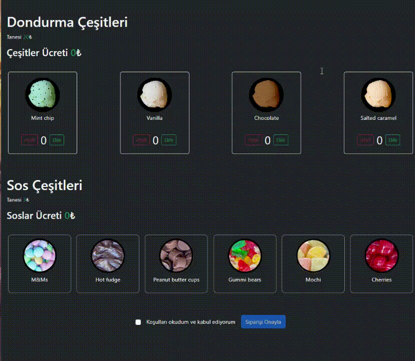

# Ice Cream App

This project is an application that displays various ice cream types and their prices. Users can view the available ice cream options and learn the price of each ice cream.

## Features
- **Listing Different Ice Cream Varieties**: Users can browse through a variety of ice creams.
- **Viewing Prices for Each Ice Cream**: Each ice cream's price is displayed for users.
- **User-Friendly Interface**: The app is designed to be intuitive and easy to navigate.
- **Easy Price Updates**: Prices can be updated easily within the app.

## Libraries and Technologies
- **React**: A JavaScript library for building user interfaces.
- **json-server**: A simple tool for setting up a fake REST API.
- **Bootstrap**: A front-end framework for designing responsive websites.
- **Axios**: A promise-based HTTP client for making requests.
- **@testing-library/user-event**: A library for testing user interactions.

## Links
- [Testing Library Queries](https://testing-library.com/docs/queries/byrole)
- [MDN Web Docs on ARIA Roles](https://developer.mozilla.org/en-US/docs/Web/Accessibility/ARIA/Roles)
- [Jest DOM](https://github.com/testing-library/jest-dom)
- [Jest Matchers](https://jestjs.io/docs/using-matchers)

## Preview

# Ice-cream---Unit-Test
